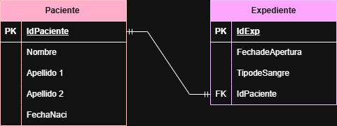
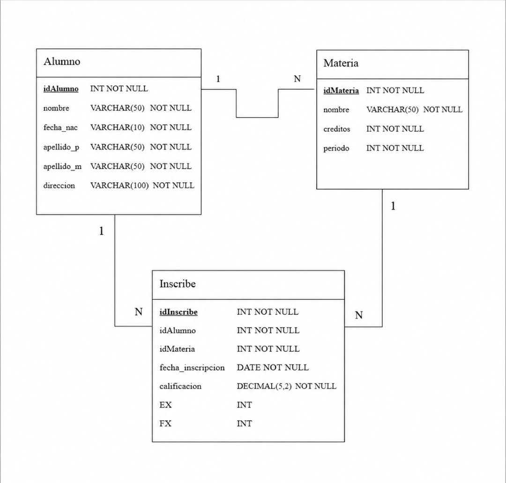
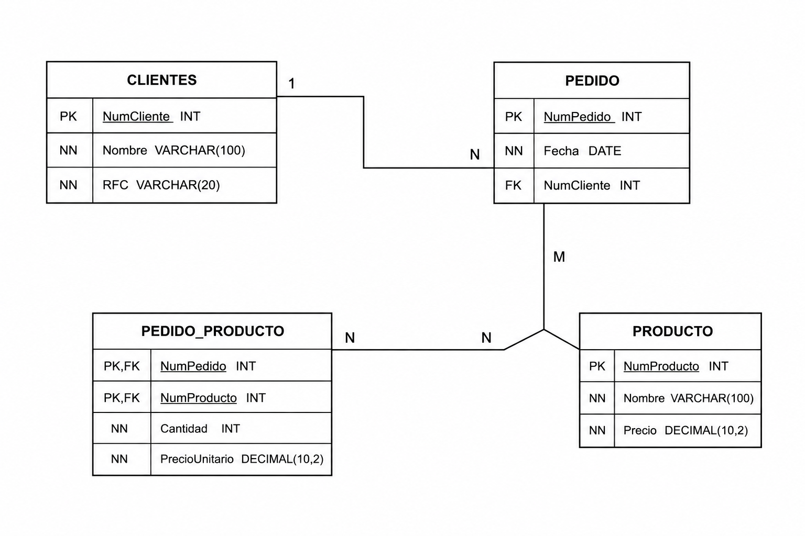
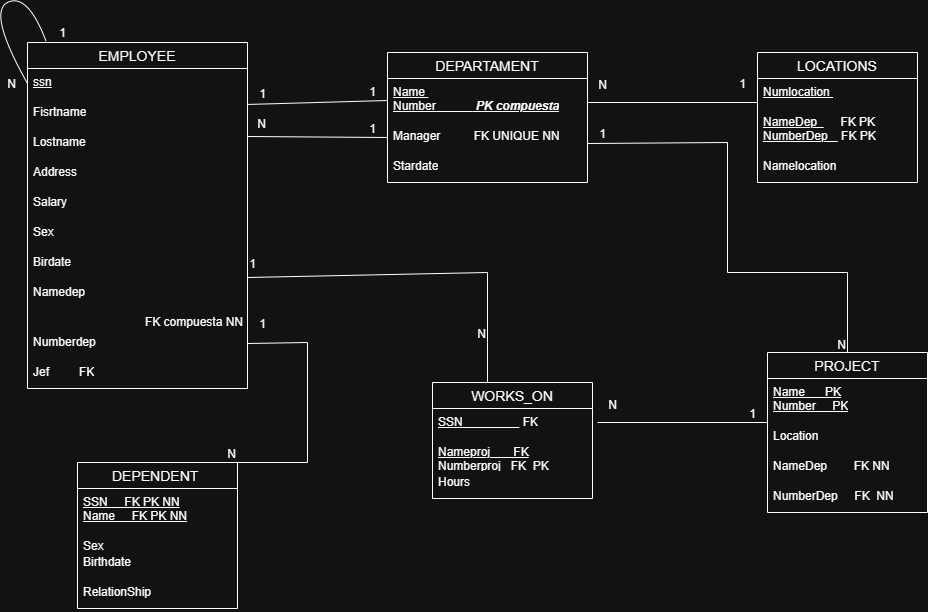
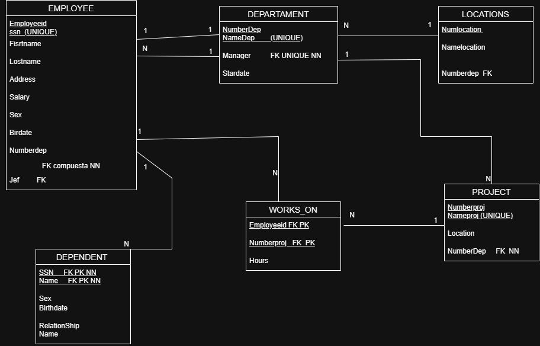

# Diccionario de Datos de la Base de Datos del Hospital

## 1. Información General

| Elemento | Valor |
| :--- | :--- |
| Proyecto | Hospital |
| Versión | 1.0 |
| Fecha | 03 de Julio 2026 |
| Elaboró | María Fernanda Hernandez Santillan |
| SGBD | SQL Server |

---

## 2. Descripción del Sistema de Base de Datos

El sistema administra la información de los pacientes y sus expedientes médicos.

Permite almacenar:

- Pacientes
- Expedientes médicos

Cada paciente cuenta con un expediente médico único donde se registra la información clínica básica.

---

## 3. Catálogo de Restricciones Utilizadas

| Código | Significado |
| :--- | :--- |
| PK | Primary Key |
| FK | Foreign Key |
| NN | NOT NULL |
| UQ | UNIQUE |
| AI | Auto Increment |
| CK | Check |
| DF | Default |

---

## 4. Diccionario de Datos

## Tabla: Paciente

**Descripción**

Almacena la información básica de los pacientes.

| Campo | Tipo | Longitud | Restricciones | Descripción |
|---------|---------|---------|---------|---------|
| id_paciente | INT | - | PK, AI, NN | Identificador único del paciente |
| nombre | VARCHAR | 100 | NN | Nombre completo del paciente |
| fecha_nacimiento | DATE | - | NN | Fecha de nacimiento |

---

## Tabla: Expediente

**Descripción**

Almacena la información del expediente médico.

| Campo | Tipo | Longitud | Restricciones | Descripción |
|---------|---------|---------|---------|---------|
| id_expediente | INT | - | PK, AI, NN | Identificador del expediente |
| numero_expediente | VARCHAR | 20 | UQ, NN | Número único del expediente |
| fecha_apertura | DATE | - | NN | Fecha de apertura |
| tipo_sangre | VARCHAR | 5 | NN | Tipo de sangre del paciente |
| id_paciente | INT | - | FK, UQ, NN | Paciente al que pertenece el expediente |

---

## 5. Relaciones en la Base de Datos

| Relación | Cardinalidad | Descripción |
| :--- | :--- | :--- |
| Paciente → Expediente | 1:1 | Cada paciente tiene un único expediente y cada expediente pertenece a un solo paciente. |

---

## 6. Matriz de Claves Foráneas

| Tabla | Campo FK | Referencia |
| :--- | :--- | :--- |
| Expediente | id_paciente | Paciente(id_paciente) |

---

## 7. Integridad Referencial

| Código | Regla |
| :--- | :--- |
| IR-01 | No se puede registrar un expediente para un paciente inexistente. |
| IR-02 | No se puede eliminar un paciente con expediente asociado sin eliminar primero el expediente. |
| IR-03 | Cada expediente pertenece únicamente a un paciente. |

---

## 8. Reglas de Negocio

| Código | Regla |
| :--- | :--- |
| RN-01 | Cada paciente tiene un identificador único. |
| RN-02 | Cada paciente posee un solo expediente médico. |
| RN-03 | Cada expediente pertenece a un único paciente. |
| RN-04 | El número de expediente es único. |
| RN-05 | La fecha de apertura es obligatoria. |
| RN-06 | El tipo de sangre debe registrarse obligatoriamente. |

---

## 9. Diagrama Relacional

# Diccionario de Datos de la Base de Datos de la Universidad

## 1. Información General

| Elemento | Valor |
| :--- | :--- |
| Proyecto | Universidad |
| Versión | 1.0 |
| Fecha |03 Julio 2026 |
| Elaboró | María Fernanda Hernandez Santillan  |
| SGBD | SQL Server |

---

## 2. Descripción del Sistema de Base de Datos

El sistema administra la información de los profesores y los cursos.

Permite almacenar:

- Profesores
- Cursos

Cada profesor puede impartir uno o varios cursos, mientras que cada curso es impartido por un solo profesor.

---

## 3. Catálogo de Restricciones Utilizadas

| Código | Significado |
| :--- | :--- |
| PK | Primary Key |
| FK | Foreign Key |
| NN | NOT NULL |
| UQ | UNIQUE |
| AI | Auto Increment |
| CK | Check |
| DF | Default |

---

## 4. Diccionario de Datos

## Tabla: Profesor

**Descripción**

Almacena la información de los profesores.

| Campo | Tipo | Longitud | Restricciones | Descripción |
|---------|---------|---------|---------|---------|
| id_profesor | INT | - | PK, AI, NN | Identificador único del profesor |
| clave_profesor | VARCHAR | 10 | UQ, NN | Clave del profesor |
| nombre | VARCHAR | 100 | NN | Nombre del profesor |
| especialidad | VARCHAR | 100 | NN | Especialidad del profesor |

---

## Tabla: Curso

**Descripción**

Almacena la información de los cursos.

| Campo | Tipo | Longitud | Restricciones | Descripción |
|---------|---------|---------|---------|---------|
| id_curso | INT | - | PK, AI, NN | Identificador único del curso |
| identificacion_curso | VARCHAR | 20 | UQ, NN | Identificación del curso |
| nombre_curso | VARCHAR | 100 | NN | Nombre del curso |
| creditos | INT | - | NN | Créditos del curso |
| id_profesor | INT | - | FK, NN | Profesor que imparte el curso |

---

## 5. Relaciones en la Base de Datos

| Relación | Cardinalidad | Descripción |
| :--- | :--- | :--- |
| Profesor → Curso | 1:N | Un profesor puede impartir varios cursos y cada curso pertenece a un solo profesor. |

---

## 6. Matriz de Claves Foráneas

| Tabla | Campo FK | Referencia |
| :--- | :--- | :--- |
| Curso | id_profesor | Profesor(id_profesor) |

---

## 7. Integridad Referencial

| Código | Regla |
| :--- | :--- |
| IR-01 | No se puede registrar un curso para un profesor inexistente. |
| IR-02 | No se puede eliminar un profesor que tenga cursos asignados sin reasignarlos previamente. |
| IR-03 | Todo curso debe estar asignado a un profesor. |

---

## 8. Reglas de Negocio

| Código | Regla |
| :--- | :--- |
| RN-01 | Un profesor puede impartir varios cursos. |
| RN-02 | Un curso solamente puede ser impartido por un profesor. |
| RN-03 | Puede existir un profesor que actualmente no imparta cursos. |
| RN-04 | Todo curso debe ser asignado a un profesor. |

---

## 9. Diagrama Relacional

# Diccionario de Datos de la Base de Datos de la Escuela

## 1. Información General

| Elemento | Valor |
| :--- | :--- |
| Proyecto | Escuela |
| Versión | 1.0 |
| Fecha | 03 de Julio 2026 |
| Elaboró | María Fernanda Hernandez Santillan |
| SGBD | SQL Server |

---

## 2. Descripción del Sistema de Base de Datos

El sistema administra la información de los alumnos, las materias y las inscripciones.

Permite almacenar:

- Alumnos
- Materias
- Inscripciones

Cada alumno puede inscribirse en una o varias materias y cada materia puede tener inscritos a varios alumnos.

---

## 3. Catálogo de Restricciones Utilizadas

| Código | Significado |
| :--- | :--- |
| PK | Primary Key |
| FK | Foreign Key |
| NN | NOT NULL |
| UQ | UNIQUE |
| AI | Auto Increment |
| CK | Check |
| DF | Default |

---

## 4. Diccionario de Datos

## Tabla: Alumno

**Descripción**

Almacena la información de los alumnos.

| Campo | Tipo | Longitud | Restricciones | Descripción |
|---------|---------|---------|---------|---------|
| id_alumno | INT | - | PK, AI, NN | Identificador único del alumno |
| matricula | VARCHAR | 15 | UQ, NN | Matrícula del alumno |
| nombre | VARCHAR | 100 | NN | Nombre del alumno |
| semestre | INT | - | NN | Semestre que cursa el alumno |

---

## Tabla: Materia

**Descripción**

Almacena la información de las materias.

| Campo | Tipo | Longitud | Restricciones | Descripción |
|---------|---------|---------|---------|---------|
| id_materia | INT | - | PK, AI, NN | Identificador único de la materia |
| clave_materia | VARCHAR | 20 | UQ, NN | Clave de la materia |
| nombre_materia | VARCHAR | 100 | NN | Nombre de la materia |
| creditos | INT | - | NN | Créditos de la materia |

---

## Tabla: Inscripción

**Descripción**

Almacena la relación entre alumnos y materias.

| Campo | Tipo | Longitud | Restricciones | Descripción |
|---------|---------|---------|---------|---------|
| id_inscripcion | INT | - | PK, AI, NN | Identificador de la inscripción |
| fecha_inscripcion | DATE | - | NN | Fecha de inscripción |
| calificacion_final | DECIMAL | 4,2 | NN | Calificación final obtenida |
| id_alumno | INT | - | FK, NN | Alumno inscrito |
| id_materia | INT | - | FK, NN | Materia inscrita |

---

## 5. Relaciones en la Base de Datos

| Relación | Cardinalidad | Descripción |
| :--- | :--- | :--- |
| Alumno → Inscripción | 1:N | Un alumno puede tener varias inscripciones. |
| Materia → Inscripción | 1:N | Una materia puede tener varias inscripciones. |

---

## 6. Matriz de Claves Foráneas

| Tabla | Campo FK | Referencia |
| :--- | :--- | :--- |
| Inscripción | id_alumno | Alumno(id_alumno) |
| Inscripción | id_materia | Materia(id_materia) |

---

## 7. Integridad Referencial

| Código | Regla |
| :--- | :--- |
| IR-01 | No se puede registrar una inscripción para un alumno inexistente. |
| IR-02 | No se puede registrar una inscripción para una materia inexistente. |
| IR-03 | No se puede eliminar un alumno que tenga inscripciones registradas sin eliminarlas previamente. |
| IR-04 | No se puede eliminar una materia que tenga alumnos inscritos sin eliminar las inscripciones correspondientes. |

---

## 8. Reglas de Negocio

| Código | Regla |
| :--- | :--- |
| RN-01 | Un alumno puede inscribirse en varias materias. |
| RN-02 | Una materia puede tener muchos alumnos inscritos. |
| RN-03 | Puede existir una materia sin alumnos inscritos. |
| RN-04 | Todo alumno debe estar inscrito en al menos una materia. |
| RN-05 | De cada inscripción se registra la fecha de inscripción. |
| RN-06 | De cada inscripción se registra la calificación final. |

---

## 9. Diagrama Relacional

# Diccionario de Datos de la Base de Datos de la Empresa

## 1. Información General

| Elemento | Valor |
| :--- | :--- |
| Proyecto | Empresa de Venta de Productos |
| Versión | 1.0 |
| Fecha | 03 Julio 2026 |
| Elaboró | María Fernanda Hernandez Santillan |
| SGBD | SQL Server |

---

## 2. Descripción del Sistema de Base de Datos

El sistema administra la información de los clientes, pedidos, productos y el detalle de cada pedido.

Permite almacenar:

- Clientes
- Pedidos
- Productos
- Detalle de Pedido

Cada cliente puede realizar varios pedidos. Cada pedido puede contener uno o varios productos, registrando la cantidad y el precio de venta de cada producto.

---

## 3. Catálogo de Restricciones Utilizadas

| Código | Significado |
| :--- | :--- |
| PK | Primary Key |
| FK | Foreign Key |
| NN | NOT NULL |
| UQ | UNIQUE |
| AI | Auto Increment |
| CK | Check |
| DF | Default |

---

## 4. Diccionario de Datos

## Tabla: Cliente

**Descripción**

Almacena la información de los clientes.

| Campo | Tipo | Longitud | Restricciones | Descripción |
|---------|---------|---------|---------|---------|
| id_cliente | INT | - | PK, AI, NN | Identificador único del cliente |
| numero_cliente | VARCHAR | 20 | UQ, NN | Número de cliente |
| nombre_cliente | VARCHAR | 100 | NN | Nombre del cliente |
| rfc | VARCHAR | 13 | UQ, NN | RFC del cliente |

---

## Tabla: Pedido

**Descripción**

Almacena la información de los pedidos realizados por los clientes.

| Campo | Tipo | Longitud | Restricciones | Descripción |
|---------|---------|---------|---------|---------|
| id_pedido | INT | - | PK, AI, NN | Identificador único del pedido |
| numero_pedido | VARCHAR | 20 | UQ, NN | Número del pedido |
| fecha | DATE | - | NN | Fecha del pedido |
| id_cliente | INT | - | FK, NN | Cliente que realizó el pedido |

---

## Tabla: Producto

**Descripción**

Almacena la información de los productos.

| Campo | Tipo | Longitud | Restricciones | Descripción |
|---------|---------|---------|---------|---------|
| id_producto | INT | - | PK, AI, NN | Identificador único del producto |
| numero_producto | VARCHAR | 20 | UQ, NN | Número del producto |
| nombre | VARCHAR | 100 | NN | Nombre del producto |
| precio | DECIMAL | 10,2 | NN | Precio del producto |

---

## Tabla: Detalle_Pedido

**Descripción**

Almacena los productos que contiene cada pedido.

| Campo | Tipo | Longitud | Restricciones | Descripción |
|---------|---------|---------|---------|---------|
| id_detalle | INT | - | PK, AI, NN | Identificador del detalle del pedido |
| cantidad | INT | - | NN | Cantidad del producto solicitado |
| precio_venta | DECIMAL | 10,2 | NN | Precio de venta del producto |
| id_pedido | INT | - | FK, NN | Pedido al que pertenece el detalle |
| id_producto | INT | - | FK, NN | Producto incluido en el pedido |

---

## 5. Relaciones en la Base de Datos

| Relación | Cardinalidad | Descripción |
| :--- | :--- | :--- |
| Cliente → Pedido | 1:N | Un cliente puede realizar muchos pedidos. |
| Pedido → Detalle_Pedido | 1:N | Un pedido puede contener varios productos mediante el detalle del pedido. |
| Producto → Detalle_Pedido | 1:N | Un producto puede aparecer en muchos pedidos mediante el detalle del pedido. |

---

## 6. Matriz de Claves Foráneas

| Tabla | Campo FK | Referencia |
| :--- | :--- | :--- |
| Pedido | id_cliente | Cliente(id_cliente) |
| Detalle_Pedido | id_pedido | Pedido(id_pedido) |
| Detalle_Pedido | id_producto | Producto(id_producto) |

---

## 7. Integridad Referencial

| Código | Regla |
| :--- | :--- |
| IR-01 | No se puede registrar un pedido para un cliente inexistente. |
| IR-02 | No se puede registrar un detalle para un pedido inexistente. |
| IR-03 | No se puede registrar un detalle para un producto inexistente. |
| IR-04 | No se puede eliminar un pedido que tenga detalles registrados sin eliminarlos previamente. |
| IR-05 | No se puede eliminar un producto que esté registrado en un detalle de pedido. |

---

## 8. Reglas de Negocio

| Código | Regla |
| :--- | :--- |
| RN-01 | Un cliente puede realizar muchos pedidos. |
| RN-02 | Cada pedido pertenece a un solo cliente. |
| RN-03 | Un pedido puede contener varios productos. |
| RN-04 | Un producto puede aparecer en muchos pedidos. |
| RN-05 | Un pedido debe contener al menos un producto. |
| RN-06 | Un producto puede no haber sido vendido. |
| RN-07 | El detalle de pedido no existe sin un pedido. |
| RN-08 | El detalle de pedido no existe sin un producto. |
| RN-09 | El detalle de pedido almacena la cantidad y el precio de venta de cada producto. |

---

## 9. Diagrama Relacional

# Diccionario de Datos de la Base de Datos de la Empresa

## 1. Información General

| Elemento | Valor |
| :--- | :--- |
| Proyecto | Empresa |
| Versión | 1.0 |
| Fecha | 03 Julio 2026 |
| Elaboró | María Fernanda Hernandez Santillan|
| SGBD | SQL Server |

---

## 2. Descripción del Sistema de Base de Datos

El sistema administra la información de los departamentos, empleados, proyectos y dependientes de una empresa.

Permite almacenar:

- Departamentos
- Empleados
- Proyectos
- Dependientes
- Ubicaciones de los departamentos
- Asignaciones de empleados a proyectos

Cada departamento es administrado por un empleado, controla uno o varios proyectos y cuenta con una o varias ubicaciones. Los empleados pertenecen a un departamento, pueden trabajar en varios proyectos y tener dependientes registrados.

---

## 3. Catálogo de Restricciones Utilizadas

| Código | Significado |
| :--- | :--- |
| PK | Primary Key |
| FK | Foreign Key |
| NN | NOT NULL |
| UQ | UNIQUE |
| AI | Auto Increment |
| CK | Check |
| DF | Default |

---

## 4. Diccionario de Datos

## Tabla: Departamento

**Descripción**

Almacena la información de los departamentos.

| Campo | Tipo | Longitud | Restricciones | Descripción |
|---------|---------|---------|---------|---------|
| id_departamento | INT | - | PK, AI, NN | Identificador único del departamento |
| numero_departamento | INT | - | UQ, NN | Número del departamento |
| nombre_departamento | VARCHAR | 100 | UQ, NN | Nombre del departamento |
| fecha_inicio_gerente | DATE | - | NN | Fecha en que el gerente inició funciones |
| id_gerente | INT | - | FK, UQ, NN | Empleado que administra el departamento |

---

## Tabla: Ubicacion_Departamento

**Descripción**

Almacena las ubicaciones de cada departamento.

| Campo | Tipo | Longitud | Restricciones | Descripción |
|---------|---------|---------|---------|---------|
| id_ubicacion | INT | - | PK, AI, NN | Identificador de la ubicación |
| ubicacion | VARCHAR | 100 | NN | Ubicación del departamento |
| id_departamento | INT | - | FK, NN | Departamento al que pertenece |

---

## Tabla: Empleado

**Descripción**

Almacena la información de los empleados.

| Campo | Tipo | Longitud | Restricciones | Descripción |
|---------|---------|---------|---------|---------|
| id_empleado | INT | - | PK, AI, NN | Identificador del empleado |
| ssn | VARCHAR | 15 | UQ, NN | Número de Seguro Social |
| nombre | VARCHAR | 100 | NN | Nombre del empleado |
| direccion | VARCHAR | 150 | NN | Dirección |
| salario | DECIMAL | 10,2 | NN | Salario |
| sexo | CHAR | 1 | NN | Sexo |
| fecha_nacimiento | DATE | - | NN | Fecha de nacimiento |
| id_departamento | INT | - | FK, NN | Departamento al que pertenece |
| id_supervisor | INT | - | FK | Supervisor del empleado |

---

## Tabla: Proyecto

**Descripción**

Almacena la información de los proyectos.

| Campo | Tipo | Longitud | Restricciones | Descripción |
|---------|---------|---------|---------|---------|
| id_proyecto | INT | - | PK, AI, NN | Identificador del proyecto |
| numero_proyecto | INT | - | UQ, NN | Número del proyecto |
| nombre_proyecto | VARCHAR | 100 | UQ, NN | Nombre del proyecto |
| ubicacion | VARCHAR | 100 | NN | Ubicación del proyecto |
| id_departamento | INT | - | FK, NN | Departamento que controla el proyecto |

---

## Tabla: Trabaja_En

**Descripción**

Almacena la asignación de empleados a proyectos.

| Campo | Tipo | Longitud | Restricciones | Descripción |
|---------|---------|---------|---------|---------|
| id_trabaja | INT | - | PK, AI, NN | Identificador de la asignación |
| horas_semana | DECIMAL | 5,2 | NN | Horas trabajadas por semana |
| id_empleado | INT | - | FK, NN | Empleado asignado |
| id_proyecto | INT | - | FK, NN | Proyecto asignado |

---

## Tabla: Dependiente

**Descripción**

Almacena la información de los dependientes.

| Campo | Tipo | Longitud | Restricciones | Descripción |
|---------|---------|---------|---------|---------|
| id_dependiente | INT | - | PK, AI, NN | Identificador del dependiente |
| nombre | VARCHAR | 100 | NN | Nombre del dependiente |
| sexo | CHAR | 1 | NN | Sexo |
| fecha_nacimiento | DATE | - | NN | Fecha de nacimiento |
| parentesco | VARCHAR | 50 | NN | Parentesco con el empleado |
| id_empleado | INT | - | FK, NN | Empleado al que pertenece |

---

## 5. Relaciones en la Base de Datos

| Relación | Cardinalidad | Descripción |
| :--- | :--- | :--- |
| Departamento → Empleado | 1:N | Un departamento tiene varios empleados. |
| Empleado → Departamento (Gerente) | 1:1 | Un empleado administra como máximo un departamento. |
| Departamento → Proyecto | 1:N | Un departamento controla varios proyectos. |
| Departamento → Ubicación_Departamento | 1:N | Un departamento puede tener una o varias ubicaciones. |
| Empleado → Trabaja_En | 1:N | Un empleado puede trabajar en varios proyectos. |
| Proyecto → Trabaja_En | 1:N | Un proyecto puede tener varios empleados. |
| Empleado → Dependiente | 1:N | Un empleado puede tener varios dependientes. |
| Empleado → Empleado | 1:N | Un supervisor puede supervisar varios empleados. |

---

## 6. Matriz de Claves Foráneas

| Tabla | Campo FK | Referencia |
| :--- | :--- | :--- |
| Departamento | id_gerente | Empleado(id_empleado) |
| Ubicacion_Departamento | id_departamento | Departamento(id_departamento) |
| Empleado | id_departamento | Departamento(id_departamento) |
| Empleado | id_supervisor | Empleado(id_empleado) |
| Proyecto | id_departamento | Departamento(id_departamento) |
| Trabaja_En | id_empleado | Empleado(id_empleado) |
| Trabaja_En | id_proyecto | Proyecto(id_proyecto) |
| Dependiente | id_empleado | Empleado(id_empleado) |

---

## 7. Integridad Referencial

| Código | Regla |
| :--- | :--- |
| IR-01 | No se puede registrar un empleado en un departamento inexistente. |
| IR-02 | No se puede registrar un proyecto para un departamento inexistente. |
| IR-03 | No se puede asignar un empleado a un proyecto inexistente. |
| IR-04 | No se puede registrar un dependiente para un empleado inexistente. |
| IR-05 | No se puede registrar una ubicación para un departamento inexistente. |
| IR-06 | No se puede asignar un gerente inexistente a un departamento. |

---

## 8. Reglas de Negocio

| Código | Regla |
| :--- | :--- |
| RN-01 | Cada departamento tiene un nombre y un número únicos. |
| RN-02 | Cada departamento es administrado por un solo empleado. |
| RN-03 | Un empleado puede administrar como máximo un departamento. |
| RN-04 | Un departamento puede tener una o varias ubicaciones. |
| RN-05 | Un departamento controla uno o varios proyectos. |
| RN-06 | Cada proyecto pertenece a un solo departamento. |
| RN-07 | Todo empleado pertenece a un único departamento. |
| RN-08 | Un empleado puede trabajar en varios proyectos. |
| RN-09 | Un proyecto puede tener varios empleados trabajando en él. |
| RN-10 | De cada asignación se almacenan las horas trabajadas por semana. |
| RN-11 | Cada empleado tiene un supervisor directo. |
| RN-12 | Un supervisor puede supervisar a varios empleados. |
| RN-13 | Un empleado puede tener cero o varios dependientes. |
| RN-14 | Cada dependiente pertenece a un solo empleado. |

---

## 9. Diagrama Relacional

